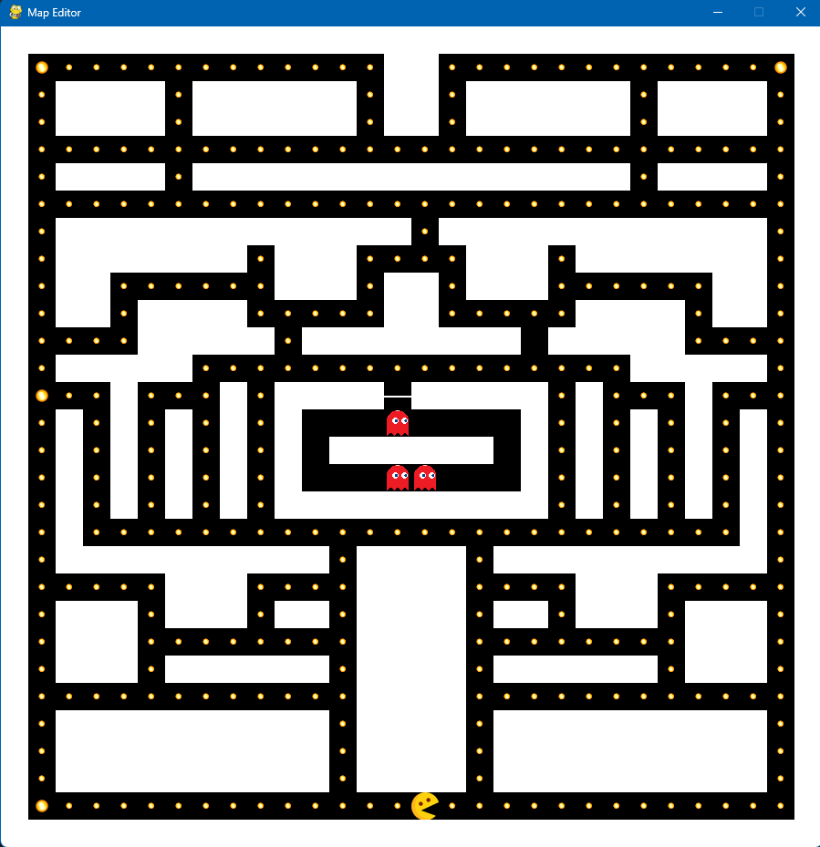
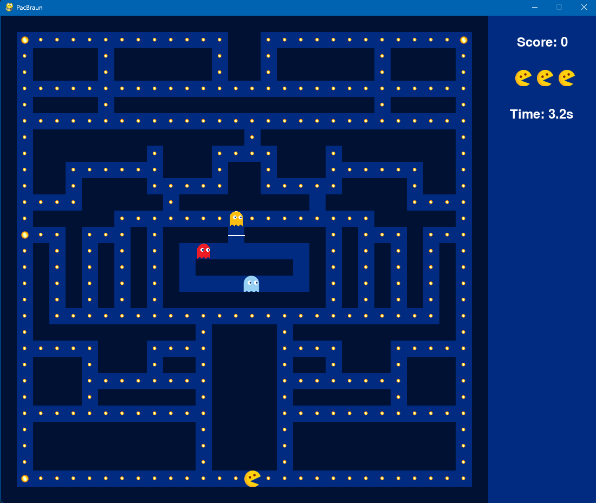
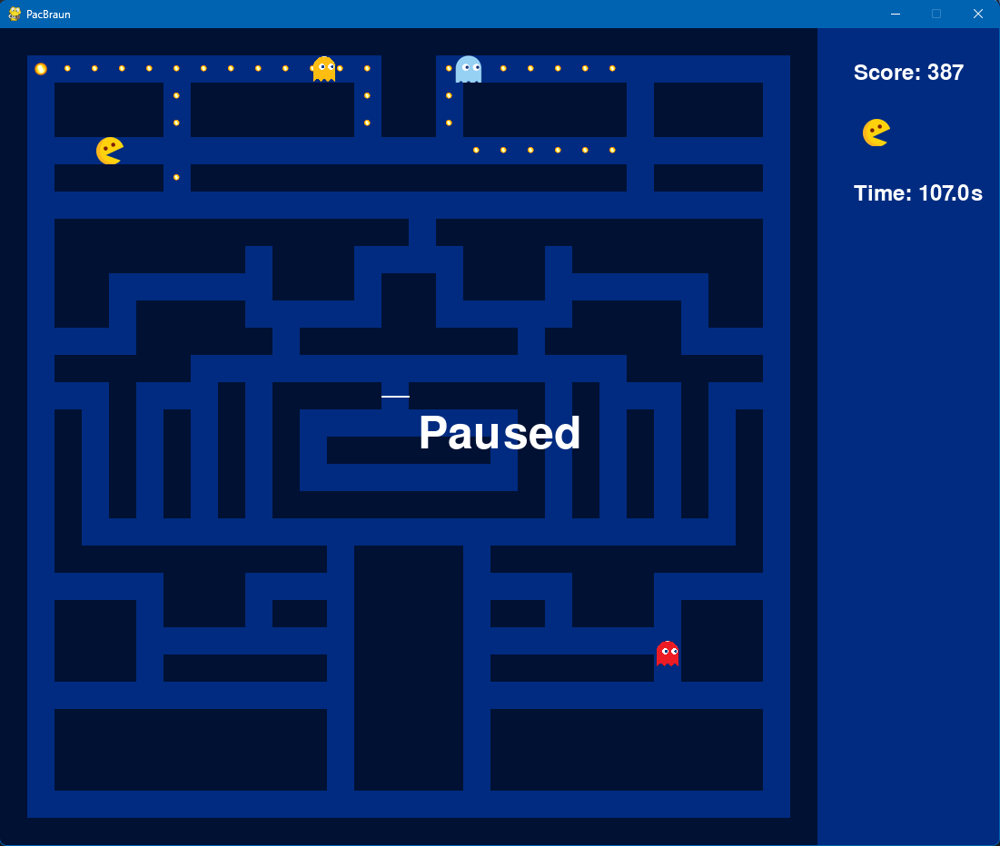
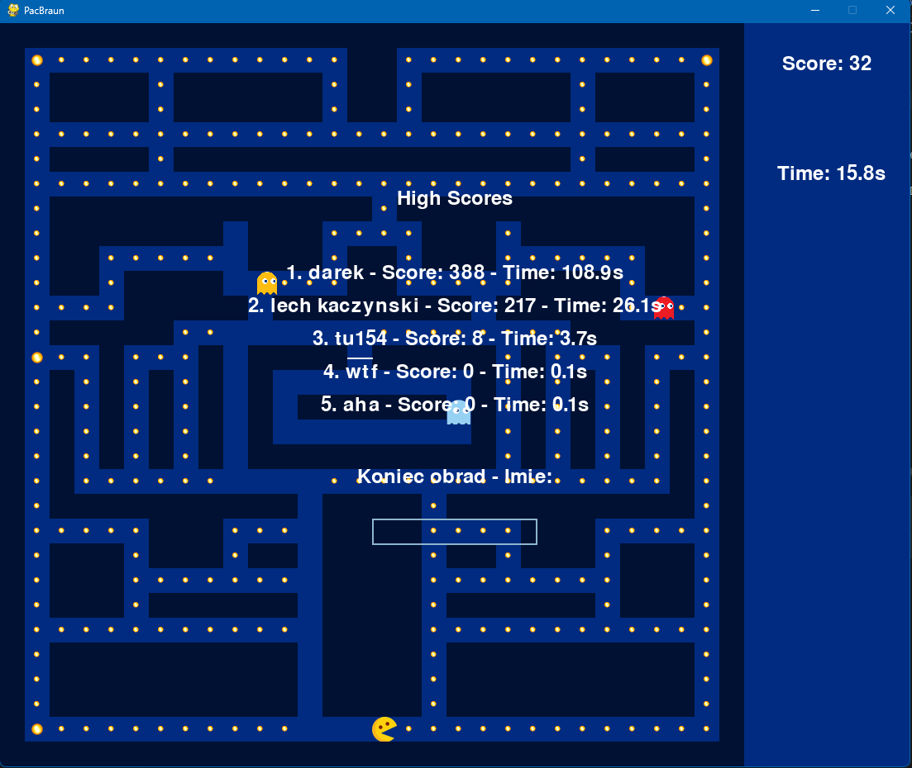

---
# PacMan - Classic Arcade Game Clone

## Description

PacMan is a simple arcade game inspired by the classic title Pac-Man. The player controls a character named PacMan, attempting to collect as many points as possible by eating dots scattered throughout the board. At the same time, the player must avoid contact with ghosts, which move around the board and try to eat PacMan. The game also features a pause function and saving/displaying the best player scores.

## Contents

The project consists of the following files:

- `game.py`: The main game module that manages the gameplay logic.
- `pacman.py`: The class representing the player character - PacMan.
- `ghost.py`: The class representing the ghosts (enemies).
- `dot.py`: The class representing the dots (items collected by the player).
- `wall.py`: The class representing the walls on the board.
- `gate.py`: The class representing the gates on the board, which can be opened or closed.
- `constants.py`: A file containing constant values used in the game.

## Requirements

To run the game, Python 3.x environment and the Pygame library are required.

## Technologies and Libraries

- Python 3.x
- Pygame

## Instructions

1. Run the `game.py` file using the Python interpreter.
2. Use the arrow keys to control PacMan.
3. Collect dots to earn points.
4. Avoid contact with ghosts.
5. Play until you run out of lives or achieve your best score!

## Screenshots

- **Map Editor**:
  

- **Gameplay**:
  

- **In-game**:
  

- **High Scores**:
  

## Author

The game was created by Dariusz Surdel.

---
